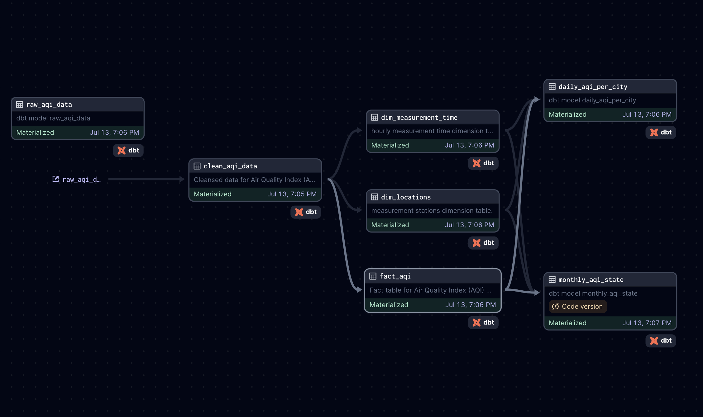

# AIRlytics
 AQI Dashboard for air quality mesurements of Indian states/cities

## 🔁 Data Flow Summary:

#### Data Ingestion

- Python script downloads hourly AQI data from REST API

#### Scheduled using Dagster

- Landing in Snowflake

- Data written to Snowflake internal stage

- Transformations using DBT


- DBT models are orchestrated via Dagster

#### Pipeline: 
- raw_aqi_data → clean_aqi_data → dims/facts → aggregates

#### Dashboarding via Streamlit

- Uses daily_aqi_per_city, monthly_aqi_state, and fact_aqi for visual insights

- Interactive filters for state, pollutant, trend types
- [Click me](https://data-alchemist.streamlit.app/) to take the dashbaord for a spin 

```
           +----------------------------+
           |    1. Data Ingestion       |
           |                            |
           | Python script (hourly)     |
           | scheduled via Dagster      |
           | -> REST API                |
           +-------------+--------------+
                         |
                         v
           +-------------+--------------+
           |   2. Landing Zone (Raw)    |
           |                            |
           | Snowflake Internal Stage   |
           +-------------+--------------+
                         |
                         v
           +-------------+--------------+
           |     3. Transformation      |
           |        (via DBT)           |
           |   Scheduled via Dagster    |
           +-------------+--------------+
                         |
     ┌───────────────────┴────────────────────┐
     |                                        |
     v                                        v
+-------------------+          +---------------------------+
|  raw_aqi_data     |          |  clean_aqi_data           |
| (Staged raw data) |          | (Cleansed + enriched)     |
+-------------------+          +---------------------------+
                                       |
                                       v
                      +-------------------------------+
                      |   Dimension & Fact Models     |
                      |-------------------------------|
                      |  dim_locations                |
                      |  dim_measurement_time         |
                      |  fact_aqi                     |
                      +-------------------------------+
                                       |
                                       v
             +---------------------------------------------+
             |           Aggregate / Summary Tables        |
             |---------------------------------------------|
             |  daily_aqi_per_city                         |
             |  monthly_aqi_state                          |
             +---------------------------------------------+

                         |
                         v
           +-------------+--------------+
           | 4. Visualization Layer     |
           |                            |
           | Streamlit Dashboard        |
           | - Pollutants tab           |
           | - Trends / Comparison etc. |
           +----------------------------+


```