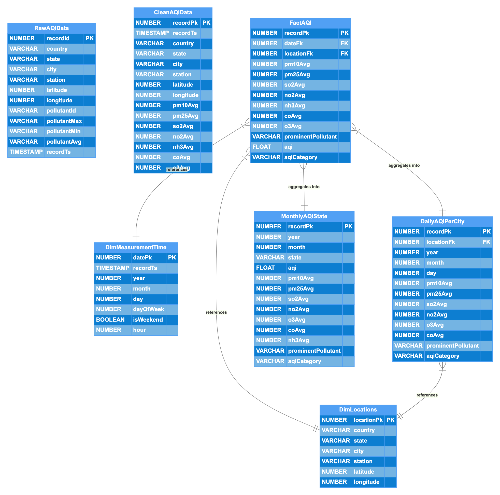

# AIRlytics
 AQI Dashboard for air quality mesurements of Indian states/cities

## 🔁 Data Flow Summary:

#### Data Ingestion

- Python script downloads hourly AQI data from [data.gov.in](https://www.data.gov.in/resource/real-time-air-quality-index-various-locations) using their REST interface

#### Scheduled using Dagster

- Raw data staged into Snowflake's internal stage via above Python script 

- Transformations using DBT


- DBT models materialization orchestrated via Dagster

#### Pipeline: 
- RAW AQI DATA → CLEAN AQI DATA → DIM / FACT TABLES → AGGREGATIONS 

#### Dashboarding via Streamlit

- Uses aggregated data for visual insights

- Interactive filters for state, pollutant, trend types
- [Click me](https://data-alchemist.streamlit.app/) to take the dashbaord for a spin 

```


+--------------------------+        +-------------------------------+        +------------------------------+        +----------------------------+
|  1. Data Ingestion       |        |     2. Landing Zone (Raw)     |        |     3. Transformation        |       |  4. Visualization Layer    |
|--------------------------|        |-------------------------------|        |------------------------------|        |----------------------------|
| Python script (hourly)   | -----> | Snowflake Internal Stage      | -----> |       DBT models             | -----> | Streamlit Dashboard        |
| Scheduled via Dagster    |        |                               |        | (hourly refresh via Dagster) |        | - AQI Dashboard            |
| -> REST API              |        |                               |        | - raw_aqi_data               |        | - Pollutant Trends         |
+--------------------------+        +-------------------------------+        | - clean_aqi_data             |        +----------------------------+
                                                                             |    - dim_locations           |
                                                                             |    - dim_measurement_time    |
                                                                             |    - fact_aqi                |
                                                                             |    - daily_aqi_per_city      |
                                                                             |    - monthly_aqi_state       |
                                                                             +------------------------------+


```

#### Schema
